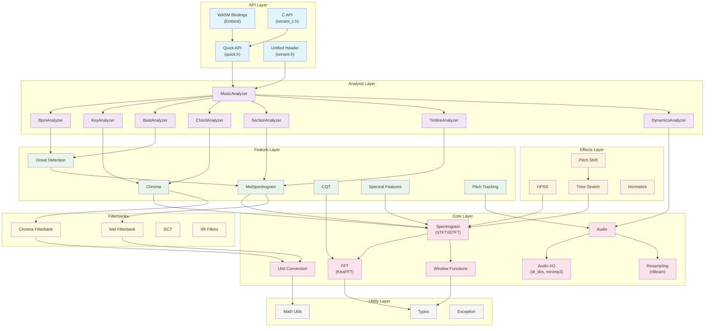
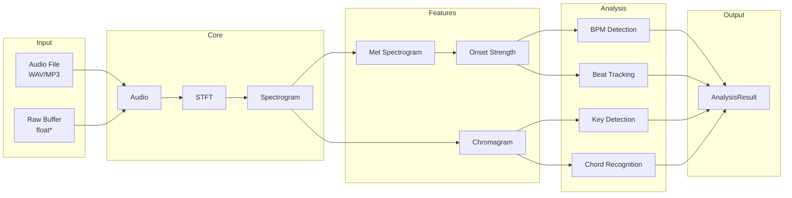
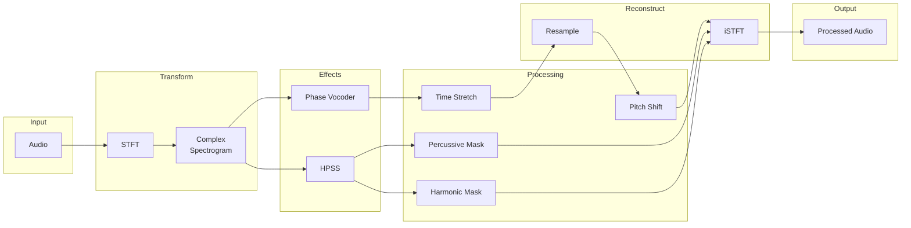
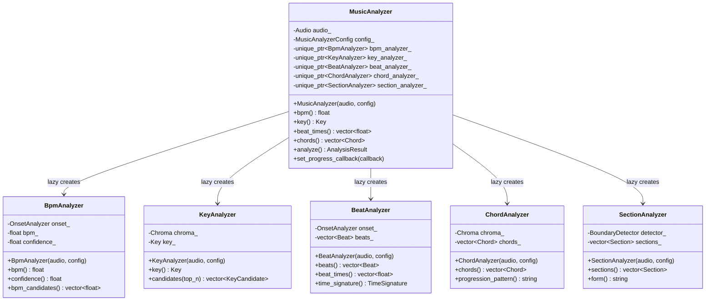
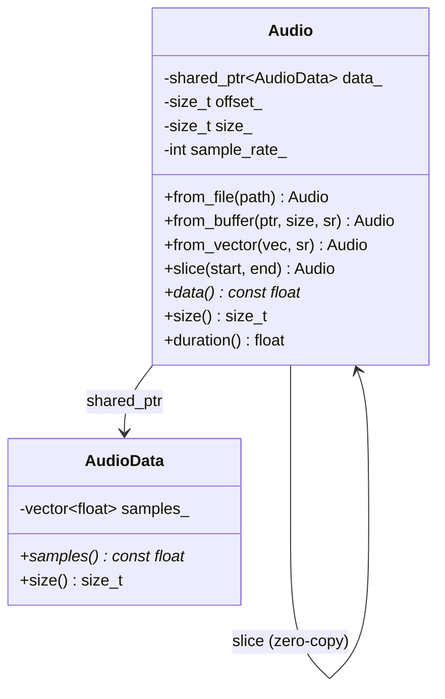

# Architecture

This document describes the internal architecture of libsonare, including module structure, data flow, and design decisions.

## Module Overview



---

## Directory Structure

```
src/
├── util/               # Level 0: Basic utilities
│   ├── types.h         # MatrixView, ErrorCode, enums
│   ├── exception.h     # SonareException
│   └── math_utils.h    # mean, variance, argmax, etc.
│
├── core/               # Level 1-3: Core DSP
│   ├── convert.h       # Hz/Mel/MIDI conversion
│   ├── window.h        # Hann, Hamming, Blackman
│   ├── fft.h           # KissFFT wrapper
│   ├── spectrum.h      # STFT/iSTFT
│   ├── audio.h         # Audio buffer
│   ├── audio_io.h      # WAV/MP3 loading
│   └── resample.h      # r8brain resampling
│
├── filters/            # Level 4: Filterbanks
│   ├── mel.h           # Mel filterbank
│   ├── chroma.h        # Chroma filterbank
│   ├── dct.h           # DCT for MFCC
│   └── iir.h           # IIR filters
│
├── feature/            # Level 4: Feature extraction
│   ├── mel_spectrogram.h
│   ├── chroma.h
│   ├── cqt.h
│   ├── vqt.h
│   ├── spectral.h
│   ├── onset.h
│   └── pitch.h
│
├── effects/            # Level 5: Audio effects
│   ├── hpss.h          # Harmonic-percussive separation
│   ├── time_stretch.h  # Phase vocoder time stretch
│   ├── pitch_shift.h   # Pitch shifting
│   ├── phase_vocoder.h # Phase vocoder core
│   └── normalize.h     # Normalization, trim
│
├── analysis/           # Level 6: Music analysis
│   ├── music_analyzer.h    # Facade
│   ├── bpm_analyzer.h
│   ├── key_analyzer.h
│   ├── beat_analyzer.h
│   ├── chord_analyzer.h
│   ├── section_analyzer.h
│   ├── timbre_analyzer.h
│   ├── dynamics_analyzer.h
│   ├── rhythm_analyzer.h
│   ├── melody_analyzer.h
│   ├── onset_analyzer.h
│   └── boundary_detector.h
│
├── quick.h             # Simple function API
├── sonare.h            # Unified include header
├── sonare_c.h          # C API header
└── wasm/
    └── bindings.cpp    # Embind bindings
```

---

## Dependency Levels

| Level | Modules | Dependencies |
|-------|---------|--------------|
| 0 | util/ | None (header-only except math_utils) |
| 1 | core/convert, core/window | util/ |
| 2 | core/fft | util/, KissFFT |
| 3 | core/spectrum, core/audio | core/fft, core/window |
| 4 | filters/, feature/ | core/ |
| 5 | effects/ | core/, feature/ |
| 6 | analysis/ | feature/, effects/ |

---

## Data Flow

### Audio Analysis Pipeline



### Audio Effects Pipeline



---

## Class Design

### MusicAnalyzer (Facade Pattern)



### Audio Buffer (Shared Ownership)



---

## Key Design Decisions

### 1. Lazy Initialization

MusicAnalyzer uses lazy initialization for individual analyzers. This allows:
- Only compute what's needed
- Share intermediate results between analyzers
- Reduce memory when using subset of features

```cpp
// Only BPM is computed
float bpm = analyzer.bpm();

// Key detection triggers chroma computation
Key key = analyzer.key();

// Full analysis computes everything
AnalysisResult result = analyzer.analyze();
```

### 2. Zero-Copy Audio Slicing

Audio uses `shared_ptr` with offset/size for zero-copy slicing:

```cpp
auto full = Audio::from_file("song.mp3");  // 10 MB

// Both share same underlying buffer
auto intro = full.slice(0, 30);     // 0-30 sec, zero-copy
auto chorus = full.slice(60, 90);   // 60-90 sec, zero-copy
```

### 3. WASM Compatibility

Core modules avoid:
- File I/O (handled by Audio I/O layer)
- Threading (single-threaded execution)
- Dynamic loading
- System-specific APIs

All external dependencies are either:
- Header-only (Eigen3)
- Statically linked (KissFFT, dr_libs, minimp3, r8brain)

### 4. librosa Compatibility

Default parameters match librosa for easy migration:

| Parameter | Default | librosa Default |
|-----------|---------|-----------------|
| sample_rate | 22050 | 22050 |
| n_fft | 2048 | 2048 |
| hop_length | 512 | 512 |
| n_mels | 128 | 128 |
| fmin | 0 | 0 |
| fmax | sr/2 | sr/2 |

Mel scale uses Slaney formula (librosa default).

---

## Third-Party Libraries

| Library | Location | Purpose | License |
|---------|----------|---------|---------|
| KissFFT | third_party/kissfft/ | FFT | BSD-3-Clause |
| Eigen3 | System/FetchContent | Matrix ops | MPL-2.0 |
| dr_libs | third_party/dr_libs/ | WAV decode | Public Domain |
| minimp3 | third_party/minimp3/ | MP3 decode | CC0-1.0 |
| r8brain | third_party/r8brain/ | Resampling | MIT |
| Catch2 | FetchContent | Testing | BSL-1.0 |

---

## Performance Considerations

### Memory Layout

- Spectrograms stored as column-major (frequency x time)
- Compatible with Eigen's default layout
- Efficient for frequency-wise operations

### Caching

- Spectrogram caches magnitude/power on first access
- MelSpectrogram reuses filterbank matrices
- Chroma reuses chroma filterbank

### Parallelization

- Single-threaded for WASM compatibility
- Frame-level parallelism possible for native builds (future)
