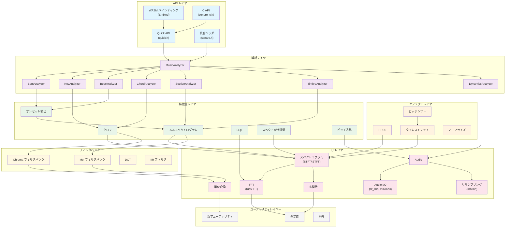
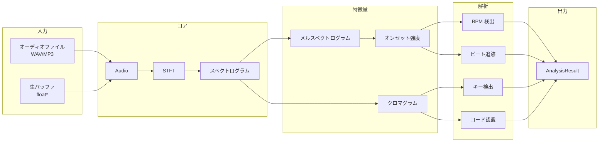
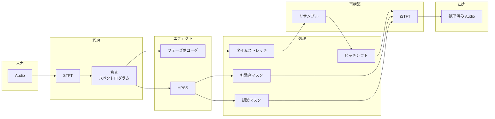
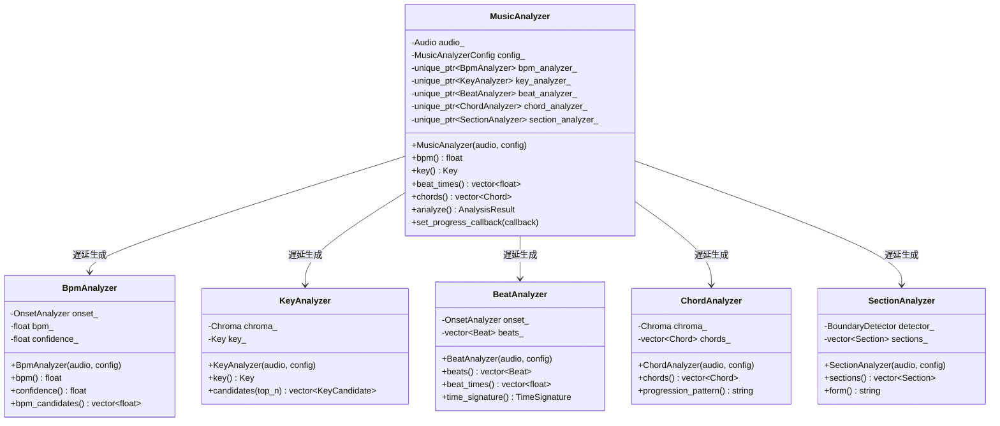
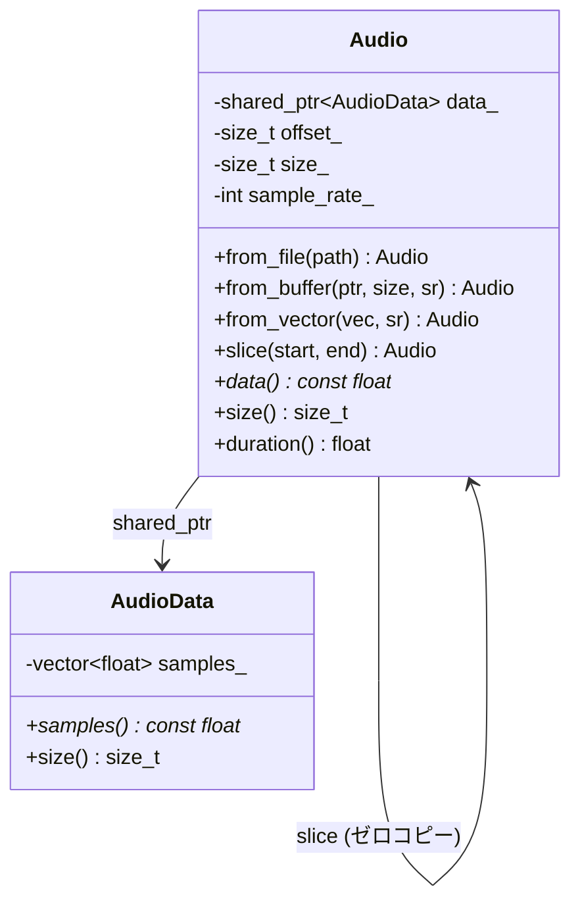

# アーキテクチャ

このドキュメントでは、libsonare の内部アーキテクチャ、モジュール構造、データフロー、設計上の決定について説明します。

## モジュール概要



---

## ディレクトリ構造

```
src/
├── util/               # レベル 0: 基本ユーティリティ
│   ├── types.h         # MatrixView, ErrorCode, 列挙型
│   ├── exception.h     # SonareException
│   └── math_utils.h    # mean, variance, argmax など
│
├── core/               # レベル 1-3: コア DSP
│   ├── convert.h       # Hz/Mel/MIDI 変換
│   ├── window.h        # Hann, Hamming, Blackman
│   ├── fft.h           # KissFFT ラッパー
│   ├── spectrum.h      # STFT/iSTFT
│   ├── audio.h         # オーディオバッファ
│   ├── audio_io.h      # WAV/MP3 読み込み
│   └── resample.h      # r8brain リサンプリング
│
├── filters/            # レベル 4: フィルタバンク
│   ├── mel.h           # Mel フィルタバンク
│   ├── chroma.h        # Chroma フィルタバンク
│   ├── dct.h           # MFCC 用 DCT
│   └── iir.h           # IIR フィルタ
│
├── feature/            # レベル 4: 特徴量抽出
│   ├── mel_spectrogram.h
│   ├── chroma.h
│   ├── cqt.h
│   ├── vqt.h
│   ├── spectral.h
│   ├── onset.h
│   └── pitch.h
│
├── effects/            # レベル 5: オーディオエフェクト
│   ├── hpss.h          # 調波・打撃音分離
│   ├── time_stretch.h  # フェーズボコーダ タイムストレッチ
│   ├── pitch_shift.h   # ピッチシフト
│   ├── phase_vocoder.h # フェーズボコーダ コア
│   └── normalize.h     # ノーマライズ、トリム
│
├── analysis/           # レベル 6: 音楽解析
│   ├── music_analyzer.h    # ファサード
│   ├── bpm_analyzer.h
│   ├── key_analyzer.h
│   ├── beat_analyzer.h
│   ├── chord_analyzer.h
│   ├── section_analyzer.h
│   ├── timbre_analyzer.h
│   ├── dynamics_analyzer.h
│   ├── rhythm_analyzer.h
│   ├── melody_analyzer.h
│   ├── onset_analyzer.h
│   └── boundary_detector.h
│
├── quick.h             # シンプルな関数 API
├── sonare.h            # 統合インクルードヘッダ
├── sonare_c.h          # C API ヘッダ
└── wasm/
    └── bindings.cpp    # Embind バインディング
```

---

## 依存関係レベル

| レベル | モジュール | 依存先 |
|--------|-----------|--------|
| 0 | util/ | なし (math_utils 以外はヘッダオンリー) |
| 1 | core/convert, core/window | util/ |
| 2 | core/fft | util/, KissFFT |
| 3 | core/spectrum, core/audio | core/fft, core/window |
| 4 | filters/, feature/ | core/ |
| 5 | effects/ | core/, feature/ |
| 6 | analysis/ | feature/, effects/ |

---

## データフロー

### オーディオ解析パイプライン



### オーディオエフェクトパイプライン



---

## クラス設計

### MusicAnalyzer (ファサードパターン)



### Audio バッファ (共有所有権)



---

## 主要な設計上の決定

### 1. 遅延初期化

MusicAnalyzer は個々のアナライザーに遅延初期化を使用します。これにより：
- 必要なものだけを計算
- アナライザー間で中間結果を共有
- 機能のサブセットのみ使用時のメモリ削減

```cpp
// BPM のみが計算される
float bpm = analyzer.bpm();

// キー検出はクロマ計算をトリガー
Key key = analyzer.key();

// フル解析はすべてを計算
AnalysisResult result = analyzer.analyze();
```

### 2. ゼロコピー オーディオスライシング

Audio はオフセット/サイズ付きの `shared_ptr` を使用してゼロコピースライシングを実現：

```cpp
auto full = Audio::from_file("song.mp3");  // 10 MB

// 両方とも同じ基礎バッファを共有
auto intro = full.slice(0, 30);     // 0-30 秒、ゼロコピー
auto chorus = full.slice(60, 90);   // 60-90 秒、ゼロコピー
```

### 3. WASM 互換性

コアモジュールは以下を回避：
- ファイル I/O (Audio I/O レイヤーで処理)
- スレッディング (シングルスレッド実行)
- 動的ローディング
- システム固有の API

すべての外部依存関係は以下のいずれか：
- ヘッダオンリー (Eigen3)
- 静的リンク (KissFFT, dr_libs, minimp3, r8brain)

### 4. librosa 互換性

デフォルトパラメータは librosa と一致し、移行を容易にします：

| パラメータ | デフォルト | librosa デフォルト |
|-----------|-----------|-------------------|
| sample_rate | 22050 | 22050 |
| n_fft | 2048 | 2048 |
| hop_length | 512 | 512 |
| n_mels | 128 | 128 |
| fmin | 0 | 0 |
| fmax | sr/2 | sr/2 |

Mel スケールは Slaney 式 (librosa デフォルト) を使用。

---

## サードパーティライブラリ

| ライブラリ | 場所 | 用途 | ライセンス |
|-----------|------|------|-----------|
| KissFFT | third_party/kissfft/ | FFT | BSD-3-Clause |
| Eigen3 | System/FetchContent | 行列演算 | MPL-2.0 |
| dr_libs | third_party/dr_libs/ | WAV デコード | Public Domain |
| minimp3 | third_party/minimp3/ | MP3 デコード | CC0-1.0 |
| r8brain | third_party/r8brain/ | リサンプリング | MIT |
| Catch2 | FetchContent | テスト | BSL-1.0 |

---

## パフォーマンス考慮事項

### メモリレイアウト

- スペクトログラムは列優先で格納 (周波数 x 時間)
- Eigen のデフォルトレイアウトと互換
- 周波数方向の演算に効率的

### キャッシング

- スペクトログラムは初回アクセス時にマグニチュード/パワーをキャッシュ
- MelSpectrogram はフィルタバンク行列を再利用
- Chroma はクロマフィルタバンクを再利用

### 並列化

- WASM 互換性のためシングルスレッド
- ネイティブビルドではフレームレベルの並列化が可能 (将来)
